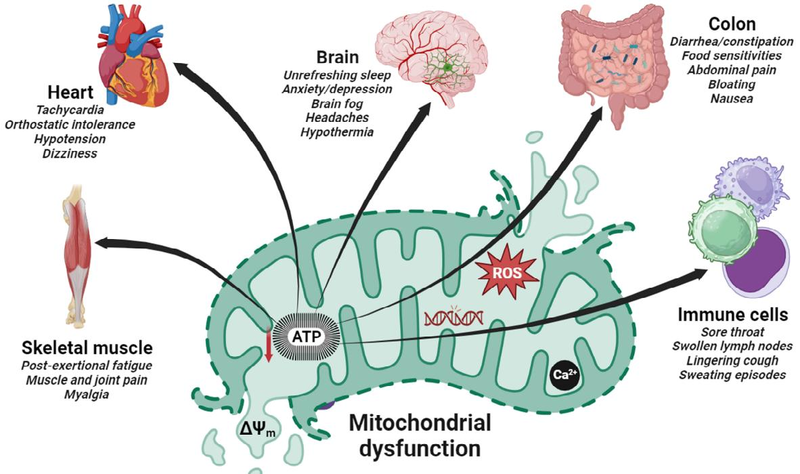

# *Review* **Mitochondrial Dysfunction and Coenzyme Q10 Supplementation in Post-Viral Fatigue Syndrome: An Overview**

**David Mantle** 1,* ,†**, Iain Parry Hargreaves** 2 **, Joan Carles Domingo** 3 **and Jesus Castro-Marrero** 4,* ,†

- 1 Pharma Nord (UK) Ltd., Morpeth, Northumberland NE61 2DB, UK
- 2 School of Pharmacy and Biomolecular Sciences, Liverpool John Moores University, Liverpool L3 3AF, UK; i.hargreaves@acl.ac.uk
- 3 Department of Biochemistry and Molecular Biomedicine, Faculty of Biology, University of Barcelona, 08028 Barcelona, Spain; jcdomingo@ub.edu
- 4 Research Unit in ME/CFS and Long COVID, Rheumatology Division, Vall d'Hebron Research Institute, Universitat Autònoma de Barcelona, 08035 Barcelona, Spain
- * Correspondence: dmantle@pharmanord.com (D.M.); jesus.castro@vhir.org (J.C.-M.)
- † These authors contributed equally to this work.

**Abstract:** Post-viral fatigue syndrome (PVFS) encompasses a wide range of complex neuroimmune disorders of unknown causes characterised by disabling post-exertional fatigue, myalgia and joint pain, cognitive impairments, unrefreshing sleep, autonomic dysfunction, and neuropsychiatric symptoms. It includes myalgic encephalomyelitis, also known as chronic fatigue syndrome (ME/CFS); fibromyalgia (FM); and more recently post-COVID-19 condition (long COVID). To date, there are no definitive clinical case criteria and no FDA-approved pharmacological therapies for PVFS. Given the current lack of effective treatments, there is a need to develop novel therapeutic strategies for these disorders. Mitochondria, the cellular organelles responsible for tissue energy production, have recently garnered attention in research into PVFS due to their crucial role in cellular bioenergetic metabolism in these conditions. The accumulating literature has identified a link between mitochondrial dysfunction and low-grade systemic inflammation in ME/CFS, FM, and long COVID. To address this issue, this article aims to critically review the evidence relating to mitochondrial dysfunction in the pathogenesis of these disorders; in particular, it aims to evaluate the effectiveness of coenzyme Q10 supplementation on chronic fatigue and pain symptoms as a novel therapeutic strategy for the treatment of PVFS.

**Keywords:** chronic fatigue syndrome; coenzyme Q10; fibromyalgia; long COVID; mitochondrial dysfunction; myalgic encephalomyelitis; post-viral fatigue syndrome

#### **1. Introduction**

Post-viral fatigue syndrome (PVFS) comprises common neuroimmune conditions of unknown aetiology based on the updated WHO International Classification of Diseases for Mortality and Morbidity Statistics (https://icd.who.int/browse11/l-m/en, accessed on 15 September 2023). PVFS includes myalgic encephalomyelitis/chronic fatigue syndrome (ME/CFS), fibromyalgia (FM), and recently post-COVID-19 condition (long COVID). PVFS is characterised by prolonged post-exertional fatigue as the hallmark symptom, which worsens with minimal physical and mental exertions, along with myalgia and joint pain; cognitive impairments; unrefreshing sleep; dysautonomia; and neuropsychiatric symptoms, such as emotional lability, anxiety/depression, and apathy, which typically occur following repeated viral infections. Although PVFS is not a generally recognised disorder, it has recently become increasingly associated with the post-COVID-19 condition [1,2].

There are over 65 million people worldwide suffering from chronic disabling disorders who are diagnosed without a clear elucidation of pathophysiologic mechanisms. In addition

**Citation:** Mantle, D.; Hargreaves, I.P.; Domingo, J.C.; Castro-Marrero, J. Mitochondrial Dysfunction and Coenzyme Q10 Supplementation in Post-Viral Fatigue Syndrome: An Overview. *Int. J. Mol. Sci.* **2024**, 25, 574. https://doi.org/10.3390/ ijms25010574

Academic Editors: Graziantonio Lauria, Rosita Curcio, Vincenza Dolce and Giuseppe Lazzarino

Received: 22 November 2023 Revised: 19 December 2023 Accepted: 30 December 2023 Published: 1 January 2024

**Copyright:** © 2024 by the authors. Licensee MDPI, Basel, Switzerland. This article is an open access article distributed under the terms and conditions of the Creative Commons Attribution (CC BY) license (https:// creativecommons.org/licenses/by/ 4.0/).

to this massive disorder burden, the CDC now estimates that a large increase in the prevalence of ME/CFS after COVID-19 is expected to affect more than 150 million people by 2050 worldwide, a challenge still unresolved by global healthcare system [3].

To date, there are no definitive diagnostic case criteria, no accurate diagnostic tests, and no FDA-approved pharmacological treatments for PVFS. Because the exact aetiology of this disorder is not fully understood, together with the unpredictable nature of symptoms, the diagnosis and management of the disease can be challenging. The onset of disease is multifactorial (e.g., a combination of immunogenetic and environmental factors); can occur suddenly or develop gradually over time; and is typically associated with triggering events, which, in addition to viral infections, may include physical and emotional trauma [4]. PVFS is often triggered by common viral infections such as the Epstein–Barr virus (EBV), human herpesvirus (HHVs), cytomegalovirus (CMV), SARS-CoV-2 (COVID-19), amongst others [5,6].

ME/CFS, FM, and long COVID are debilitating multisystem conditions that affect most body systems and are characterised by overwhelming fatigue and widespread musculoskeletal pain that is not alleviated by rest and cannot be explained by any underlying medical condition. In addition to fatigue and chronic pain as the "prime" symptoms, individuals may experience an array of symptoms such as post-exertional malaise, unrefreshing sleep, cognitive impairments commonly known as "brain fog", orthostatic intolerance, and gastrointestinal complaints [7–9].

These conditions affect millions of people of any age, gender (although predominantly women), and socio-economic burden worldwide, and the widely varying impact on individuals' daily functioning and quality of life can be significant [10,11]. The severity of the disease can fluctuate in frequency and intensity over time among patients, ranging from mild to moderate symptoms, while others can be severely affected, with around 25% housebound or bedridden [12,13]. The above conditions are established disorders, and their background will not be described further. Long COVID is a more recently recognised disorder, and it is further described below.

Post-acute sequelae of SARS-CoV-2 infection (PASC), also known as post-COVID-19 condition or long COVID, is an emerging umbrella condition, defined as a constellation of ongoing, relapsing, or new symptoms experienced by people following an acute COVID-19 infection that continue for months and even years [14,15]. While most individuals recover from a COVID-19 infection within a few weeks, some of them continue to experience prolonged symptoms that can significantly impact their daily functioning and quality of life. People who experience long COVID sometimes refer to themselves as "long-haulers" [16]. The term "long COVID" will be used throughout this review.

A significant portion of convalescent COVID-19 patients, estimated at 10–30% (over 30 million people in the U.S., 20 million in Europe, and up to 180 million worldwide) may experience long COVID [17]. The wide variation in the estimated prevalence of long COVID within and between countries may result from a number of determinants, including the age and sex of subjects, comorbid health conditions, the timing of assessment, sociodemographic factors, self-reported questionnaire variabilities, etc. [18]. There is emerging evidence suggesting that some individuals with long COVID exhibit symptoms common to patients with ME/CFS and FM, indicating potential overlapping biological pathomechanisms, although this is still unclear [1].

The precise pathomechanism underlying long COVID is unknown and is the subject of ongoing research. Risk factors for long COVID include increasing age, obesity, pre-existing respiratory disorders, and sociodemographic factors [18]. However, it is not yet clear why some individuals develop long COVID, while others recover fully after an acute COVID-19 infection. Long COVID can affect individuals varying in the severity of initial infection, including asymptomatic children/adolescents [19]. Long-term longitudinal clinical and -omics studies are needed to determine if long COVID can lead to distinct subgroups using cluster analysis in some individuals with ME/CFS and FM [20,21].

ME/CFS, FM, and long COVID can occur independently or an coexist in some individuals with other comorbid health conditions, such as irritable bowel syndrome (IBS), and mood disorders, such as anxiety/depression, which can further complicate the understanding and management of these conditions [22]. There is currently no cure for these disorders; a multidisciplinary approach that focuses on symptom relief, pacing activities, and improving overall well-being for affected people is often employed [23–26]. While the exact cause of these illnesses remains unknown, ongoing research is crucial to unravel the complexities of the connection between these conditions, and to develop a prominent hypothesis to deepen our understanding of the aetiology, underlying pathomechanisms, and risk factors; to develop more effective diagnostic tools; and to identify more effective treatment strategies.

This article aims to evaluate the evidence relating to mitochondrial dysfunction in the pathogenesis of PVFS; in particular, it aims to review issues relating to the efficacy of coenzyme Q10 (CoQ10) supplementation as a novel therapeutic strategy for the treatment of post-viral fatigue syndrome.

#### **2. Evidence of Mitochondrial Dysfunction in Post-Viral Fatigue Syndrome**

Mitochondria, the cellular powerhouses responsible for energy production, have recently garnered attention in the research into PVFS due to their crucial role in cellular energy metabolism. In addition to their role in energy production, mitochondria have key roles in many other aspects of cell metabolism, including free radical metabolism, calcium homeostasis, pyrimidine and lipid synthesis, and apoptosis [27–29]. The accumulating literature has identified a link between mitochondrial dysfunction (including oxidative stress, redox imbalance, altered mitochondrial membrane potential/permeability, disrupted calcium homeostasis, and impaired ATP production) and low-grade systemic inflammation in ME/CFS, FM, and long COVID patients [30,31].

Research has indicated that patients with ME/CFS, FM, and long COVID often exhibit abnormalities in mitochondrial function. Studies have shown that decreased ATP production, impaired mitochondrial respiration, abnormal mitochondrial DNA levels, immune dysregulation, increased oxidative stress, imbalance redox metabolism, and chronic systemic inflammation perpetuate symptoms in these patients [32–34]. Additionally, abnormalities in the mitochondrial structure and function have been also observed in muscle biopsies, indicating a systemic impact on energy production. These findings suggest that mitochondrial dysfunction could contribute to the energy depletion and fatigue experienced in these disorders [35–37]. In addition to fatigue, these diseases are frequently accompanied by a variety of overlapping symptoms, such as cognitive impairments, sleep disturbances, brain fog, concentration/memory impairments, and muscle pain. These symptoms can be attributed, at least partially, to mitochondrial dysfunction, which can have an impact on brain energy metabolism [38,39] (Figure 1).

Several studies have reported mitochondrial abnormalities in skeletal muscle cells of ME/CFS patients compared to healthy controls. Another study reported lower mitochondrial respiration rates and increased mitochondrial reactive oxygen species production in the immune cells of ME/CFS patients. These findings suggest that there are potential mitochondrial impairments in ME/CFS, contributing to energy production deficits and oxidative stress [40,41]. Similarly, in FM, some studies have observed evidence of mitochondrial dysfunction. Research has shown reduced mitochondrial ATP production, impaired oxidative phosphorylation, and increased oxidative stress biomarkers in the muscle cells of FM patients. However, more studies are needed to validate and expand upon these findings [34,42].

Regarding post-COVID-19 syndrome, emerging research has indicated potential evidence of mitochondrial dysfunction in the blood immune cells of COVID-19 patients. When the COVID-19 virus first enters the host respiratory tract, infection is initiated via the binding of the spike protein with angiotensin-converting enzyme 2 (ACE2) receptors, with the subsequent utilization of the transmembrane protease-serine 2 (TMPRSS2) to enter host

cells; the virus then hijacks the host cellular machinery for viral RNA replication and protein production [43]. In a similar manner, there is evidence that the SARS-CoV-2 is able also to hijack the host cells' mitochondria for viral advantage, for example, to evade host immune response [44]. It is of note that many other viral, bacterial, fungal, or parasitic pathogens also modulate the host cells' mitochondrial function to evade a host immune response and to promote infection [45]. The subject of mitochondrial hijacking in fatigue-related disorders is further described in a subsequent section of this article. *Int. J. Mol. Sci.* **2024**, 25, 574 4 of 17

**Figure 1.** Schematic representation of mitochondrial dysfunction involved in the pathogenesis of post-viral fatigue syndrome. The most prevalent clinical features in these disorders affect the brain, the heart, skeletal muscle cells, immune cells, and the intestine (colon). Dysfunctions are commonly caused in multiple organ systems with a clinical spectrum that varies within and between patients. The resulting fall in ATP production due to a reduced mitochondrial membrane potential (ΔΨm) and an increased ROS generation has a deleterious effect on a number of major ATP-consuming organs in patients with PVFS causing the cardinal symptoms shown. **Figure 1.** Schematic representation of mitochondrial dysfunction involved in the pathogenesis of post-viral fatigue syndrome. The most prevalent clinical features in these disorders affect the brain, the heart, skeletal muscle cells, immune cells, and the intestine (colon). Dysfunctions are commonly caused in multiple organ systems with a clinical spectrum that varies within and between patients. The resulting fall in ATP production due to a reduced mitochondrial membrane potential (∆Ψm) and an increased ROS generation has a deleterious effect on a number of major ATP-consuming organs in patients with PVFS causing the cardinal symptoms shown.

Several studies have reported mitochondrial abnormalities in skeletal muscle cells of ME/CFS patients compared to healthy controls. Another study reported lower mitochondrial respiration rates and increased mitochondrial reactive oxygen species production in the immune cells of ME/CFS patients. These findings suggest that there are potential mitochondrial impairments in ME/CFS, contributing to energy production deficits and oxidative stress [40,41]. Similarly, in FM, some studies have observed evidence of mitochondrial dysfunction. Research has shown reduced mitochondrial ATP production, impaired oxidative phosphorylation, and increased oxidative stress biomarkers in the muscle cells COVID-19 can cause systemic inflammation and oxidative stress, which may impact mitochondrial function. Preliminary studies have shown mitochondrial abnormalities in tissues and cells affected by COVID-19, including the lung epithelial cells and immune cells. However, more research is needed to understand the specific relationship between mitochondrial dysfunction and the post-COVID condition [46]. Several mechanisms may underlie mitochondrial dysfunction in PVFS. These include viral-induced mitochondrial damage, dysregulation of mitochondrial biogenesis and dynamics, immune-mediated mitochondrial dysfunction, and increased oxidative stress. Additionally, dysregulated mitochondrial calcium handling and impaired mitochondrial membrane potential may further contribute to the pathogenesis of PVFS [47–49].

of FM patients. However, more studies are needed to validate and expand upon these findings [34,42]. Regarding post-COVID-19 syndrome, emerging research has indicated potential evidence of mitochondrial dysfunction in the blood immune cells of COVID-19 patients. When the COVID-19 virus first enters the host respiratory tract, infection is initiated via the binding of the spike protein with angiotensin-converting enzyme 2 (ACE2) receptors, with the subsequent utilization of the transmembrane protease-serine 2 (TMPRSS2) to en-One theory proposes that mitochondrial dysfunction in these diseases could be caused by a combination of genetic predisposition and environmental factors. Genetic variations in genes involved in mitochondrial function and energy metabolism, such as those related to the mitochondrial DNA, electron transport chain components, and oxidative stress response, may increase the susceptibility to mitochondrial dysfunction in individuals with PVFS. Moreover, various environmental triggers, including infectious agents, toxins, and physical or emotional stressors, have been proposed as potential triggers that can

ter host cells; the virus then hijacks the host cellular machinery for viral RNA replication and protein production [43]. In a similar manner, there is evidence that the SARS-CoV-2 is able also to hijack the host cells' mitochondria for viral advantage, for example, to evade host immune response [44]. It is of note that many other viral, bacterial, fungal, or parasitic pathogens also modulate the host cells' mitochondrial function to evade a host immune response and to promote infection [45]. The subject of mitochondrial hijacking in fatigue-

COVID-19 can cause systemic inflammation and oxidative stress, which may impact mitochondrial function. Preliminary studies have shown mitochondrial abnormalities in tissues and cells affected by COVID-19, including the lung epithelial cells and immune

related disorders is further described in a subsequent section of this article.

induce or exacerbate mitochondrial dysfunction in susceptible individuals. These triggers may lead to mitochondrial damage, oxidative stress, and inflammation, further impairing mitochondrial function and perpetuating the cycle of fatigue and other core symptoms in people with PVFS [50–55].

Understanding the connection between mitochondrial dysfunction and cardinal symptoms in PVFS has important clinical implications. Biomarkers of mitochondrial dysfunction, such as markers of oxidative stress and mitochondrial DNA damage, may aid in the diagnosis and subtyping of PVFS. Furthermore, targeting mitochondrial dysfunction through therapeutic interventions aimed at improving the mitochondrial function and reducing oxidative stress and imbalance redox holds promise for the management of PVFS. For example, supplementation with CoQ10 has shown promise in alleviating symptoms in some PVFS patients. However, further research is crucial to unravel the complexities of this connection, to develop targeted interventions to improve the quality of life for these individuals, and to explore the effectiveness and safety of such interventions [56–64]. The rationale for CoQ10 supplementation with regard to mitochondrial hijacking is considered in the following section.

#### **3. Hijacking of Host Mitochondria in Post-Viral Fatigue Related Disorders**

In addition to their role in cellular energy provision, mitochondria also have a key role in the host innate immune response in the first line defence against RNA viruses. Viral infection results in the activation of mitochondrial antiviral signalling proteins (MAVSs), which in turn results in the release of cytokines/chemokines and growth factors by the infected cell; this induces a further immune response which kills the infected host cell, facilitating clearance of the infecting virus [65,66]. Certain types of virus such as SARS-CoV-2 have adapted to promote viral survival and replication by suppressing the host immune response; by forming double-membrane vesicles (DMVs) around its RNA, thus shielding the latter from detection; and by inhibiting the MAVSs in the antiviral innate immune response [67]. While these DMVs are generally believed to be formed via viruses manipulating the endoplasmic reticulum (ER) membrane, the mechanism for importing and packaging proteins and RNA into these miniature organelles is not clearly understood [68]. One possible mechanism for importing viral RNA involves the virus exploiting the RNA localization mechanisms that the cell already possesses for endogenous double-membrane organelles, namely, the mitochondria.

In addition, the COVID-19 virus can directly impair the mitochondrial energy metabolism via targeted action on oxygen availability and utilization, and an effective host immune response will be impaired when the available mitochondrial energy is reduced [69]. COVID-19 viruses produce accessory proteins called open reading frames (ORFs), which interact with mitochondrial outer membrane receptors. One particular interaction involves an ORF-9 interaction with MAVSs in their role as mitochondrial import receptors and cytoplasmic viral recognition receptors [70]. Thus, ORFs have been shown to suppress the activity of MAVSs, thus limiting the initial host cell, innate immune, interferon, and antiviral responses. The interactions of the SARS-CoV-2 proteins such as ORFs and NSP with host cell mitochondrial proteins lead to the loss of membrane integrity and also cause dysfunction in the bioenergetics of the mitochondria.

The hijacking of the mitochondria by intracellular viral RNA and protein components also occurs during infections with the Ebola, Zika, and influenza A viruses [71]. It follows that drugs that help to prevent mitochondrial hijacking or restore mitochondrial function (of which CoQ10 would be an example) may provide novel therapeutic strategies to help prevent or treat the virus infection [72]. As noted in the section of this article on COVID-19 infections, to date variable outcomes have been reported from clinical studies supplementing CoQ10 in COVID-19 patients. Thus, an open study by Barletta et al. reported supplementation with 200 mg/day of CoQ10 and 200 mg/day of alpha lipoic acid for 2 months improved fatigue in chronic COVID-19 patients [73]. However, a randomised controlled trial supplementing CoQ10 (500 mg/day for 6 weeks) found no significant benefit on reducing the number or severity of symptoms in patients with the post-COVID-19 condition [74]. The development of novel therapies based on countering the effects of the viral hijacking of host mitochondria in post-infectious fatigue disorders therefore remains an area for more intensive future research.

## **4. Effects of Coenzyme Q10 Supplementation in Post-Viral Fatigue Related Conditions**

All of the clinical studies described below supplemented the oxidised form of CoQ10 (ubiquinone) unless otherwise specified (Table 1).

**Table 1.** Summary of clinical trials conducted on mitochondria dysfunction-targeted CoQ10 supplementation in post-viral fatigue syndrome.

| Population | Case | CoQ10 Daily Dose and | Sample | Study | Outcomes | Refs. |
| --- | --- | --- | --- | --- | --- | --- |
|  | Criteria | Duration | Size | Design |  |  |
|  |  | 300 mg for |  |  | Reduced chronic pain and fatigue, improved mitochondrial | Cordero et al., |
| FM | 1990 ACR |  | 20 | RCT | bioenergetic function, and |  |
|  |  | 40 days |  |  |  | 2013 [75] |
|  |  |  |  |  | reduced oxidative stress and inflammation |  |
|  |  | 300 mg for |  |  | Regulated serotonin | Alcocer Gómez et al., |
| FM | 2010 ACR |  | 20 | RCT | levels in platelets and improved |  |
|  |  | 40 days |  |  | depression symptoms | 2014 and 2017 |
|  |  |  |  |  |  | [76,77] |
| FM | 1990 ACR | 300 mg for | 20 cases | Case-control | Significant negative correlations between CoQ10 or catalase levels parameters, restored biochemical parameters, | Cordero et al., |
|  |  |  |  |  | in PBMCs and headache |  |
|  |  | 40 days | 15 controls | study |  | 2012 [78] |
|  |  |  |  |  | and improved |  |
|  |  |  |  |  | clinical symptoms |  |
| FM | 1990 ACR | 2 × 200 mg for 6 months | 22 | Open-label crossover study | Significantly improved most pain-related outcomes by | Di Pierro et al., 2017 |
|  |  |  |  |  | 24–37%, including fatigue (by |  |
|  |  |  |  |  | ~22%) and | [79] |
|  |  |  |  |  | sleep disturbance (by ~33%) |  |
| FM | 2010 ACR | Pregabalin with CoQ10 or pregabalin with |  |  | Reduced greater pain, anxiety, inflammation, and | Sawaddiruk |
|  |  |  | 11 | RCT crossover | mitochondrial oxidative stress, | et al., 2019 |
|  |  | placebo for 40 days |  | study | along with increased GSH levels | [80] |
|  |  |  |  |  | and superoxide dismutase levels |  |
| FM | Not given | 200 mg CoQ10 and extract for 84 days |  | Open-label pilot study | Improved quality of life and improved self-rating with 64% claiming to be better and only | Lister et al., 2002 [81] |
|  |  | 200 mg Ginkgo biloba | 25 |  |  |  |
|  |  |  |  |  | 9% claiming to feel worse |  |
| FM | 2016 ACR | 150 mg CoQ10 combined with vitamin D, alpha-lipoic acid, magnesium, and | 55 | RCT | Reduced pain at 1 month after the start of therapy, strengthened after 3 months | Schweiger et al., 2020 |
|  |  | tryptophan or |  |  | with the maintenance | [82] |
|  |  | acupuncture treatment, both for 3 months |  |  | of treatment |  |
|  | eHRs from Israel Clalit |  |  |  | Case studies showing ubiquinone associated with |  |
| Long |  |  | 6953 cases | Retrospective | significantly | Israel et al., |
| COVID | Health | Not given | 6530 controls | case-control | reduced odds for COVID-19 | 2021 [83] |
|  | Services |  |  | study | hospitalization (OR = 0.185, |  |
|  | provider |  |  |  | 95% CI (0.058–0.458), p < 0.001) |  |
| Long | 2015 | 100 mg CoQ10 and |  | Prospective | Complete Fatigue Severity Scale | Barletta et al., |
|  | IOM/NIH | 100 mg alpha-lipoic acid | 174 | observational | response was reached more |  |
| COVID | criteria for | (n = 116) or placebo |  | study | frequently in treatment group | 2023 [73] |
|  | ME/CFS | (n = 58) for 60 days |  |  | (53.5%) than in placebo (3.5%) |  |

| Population | Case | CoQ10 Daily Dose and | Sample | Study | Outcomes | Refs. |
| --- | --- | --- | --- | --- | --- | --- |
|  | Criteria | Duration | Size | Design |  |  |
| Long | 2021 | 500 mg or placebo for 6 weeks, with crossover |  | RCT | No significant benefit on chronic | Hansen et al., |
| COVID | WHO clinical | treatment after a 4-week | 119 | crossover trial | COVID-19 symptoms | 2023 [74] |
|  | case definition | washout period |  |  |  |  |
| ME/CFS | 1994 CDC/Fukuda | 200 mg CoQ10 and 20 mg of NADH |  |  | Reduced cognitive fatigue perception and overall FIS-40 | Castro |
|  |  |  |  |  | score and improved quality of |  |
|  |  |  | 207 | RCT | life; improved sleep duration at | Marrero et al., |
|  |  | (n = 104) or placebo |  |  | 4 weeks and improved habitual | 2021 [63] |
|  |  | (n = 103) for 12 weeks |  |  | sleep efficiency |  |
|  |  |  |  |  | at 8 weeks |  |
| ME/CFS | 1994 | 400 mg CoQ10 and |  | Open-label | Improved overall fatigue severity and global quality of life but no significant effect on sleep | Castro |
|  | CDC/Fukuda | 200 mcg selenium for | 27 | exploratory | disturbances; increased total | Marrero et al., |
|  |  | 8 weeks |  | study | antioxidant capacity, reduced | 2022 [64] |
|  |  |  |  |  | lipoperoxide levels, and decreased |  |
|  |  |  |  |  | circulating cytokine levels |  |
| ME/CFS | 1994 | 150 mg ubiquinol or placebo for | 20 | RCT | Improved autonomic function | Fukuda et al., |
|  | CDC/Fukuda |  |  |  | and cognitive function | 2016 [84] |
|  |  | 3 months |  |  |  |  |

**Table 1.** *Cont.*

# *4.1. Coenzyme Q10 Supplementation in Fibromyalgia*

With regard to interventions through nutritional supplementation in fibromyalgia, CoQ10 (alone or in nutrient combinations) has been shown to be effective in clinical studies for the symptomatic relief of this disorder. As noted in earlier sections of this article, fibromyalgia patients have depleted CoQ10 levels in tissues (typically 40–50% of the normal level), together with increased levels of mitochondrial dysfunction, oxidative stress, and inflammation, both in adults and in children/adolescents [85,86].

A randomised controlled clinical study by Cordero et al. [75] conducted in 20 FM patients found supplementation with CoQ10 (300 mg/day for 40 days) significantly reduced (by more than 50%) chronic pain and fatigue; there was a corresponding improvement in mitochondrial energy generation and reduced oxidative stress and inflammation. In this study, psychopathological symptoms (including anxiety/depression) were also significantly improved; this was linked to the effect of supplemental CoQ10 in reducing oxidative stress and inflammation, as well as increased levels of serotonin [76,77]. In addition, Cordero et al. [78] correlated headache symptoms with reduced CoQ10 levels and increased oxidative stress in the FM patients, with headache symptoms and oxidative stress levels significantly improved following CoQ10 supplementation (300 mg/day for 3 months). In adolescent FM patients (aged 8–17 years), Miyamae et al. [86] reported CoQ10 supplementation (100 mg/day for 3 months) significantly improved fatigue. In an open-label crossover study, supplementation with a water-soluble form of CoQ10 (400 mg/day for 6 months) resulted in significant reductions (by 20–40%) in chronic fatigue and pain [79].

A clinical study by Sawaddiruk et al. [80] described the role of supplementary CoQ10 in further reducing chronic pain in FM patients treated with pregabalin. In a double-blind randomised controlled study, the FM patients were treated either with pregabalin plus CoQ10 or pregabalin plus a placebo for 6 weeks. After a 2-week washout period, patients in the pregabalin plus CoQ10 group were switched to pregabalin plus a placebo, and vice-versa, for a further 6 weeks. Several parameters were monitored during the study, including the pain pressure threshold, pain score, and anxiety/depression level, as well as the biomarkers of antioxidant activity, inflammation, and mitochondrial dysfunction. While pregabalin alone reduced pain and anxiety/depression, there was no effect on inflammation and mitochondrial function. However, the treatment with pregabalin plus CoQ10 resulted in a significantly greater reduction in pain and anxiety/depression, together with

a reduction in oxidative stress, inflammation, and mitochondrial dysfunction. The results from this study provide evidence that supplementary CoQ10 can provide further pain relief in FM patients treated with pregabalin, through reducing oxidative stress imbalance and inflammation and improving mitochondrial function.

With regard to nutrient combinations, an open uncontrolled study of 23 FM patients reported supplementation with 200 mg of CoQ10 and 200 mg of ginkgo biloba resulted in a significant improvement in health-related quality of life [81]. In a randomised controlled trial conducted in 21 FM patients supplemented with CoQ10, vitamin D, alpha-lipoic acid, magnesium, and tryptophan for 3 months, there was a significant reduction in pain [82].

#### *4.2. Coenzyme Q10 Supplementation in Acute COVID-19 Infection*

In a clinical study by Israel et al. [83], the intake of CoQ10 was associated with a significantly reduced risk of hospitalisation for COVID-19 patients. Fernandez-Ayala et al. [87] reviewed the evidence for mitochondrial dysfunction as a key factor determining the severity of a SARS-CoV-2 infection; in particular, the authors noted the increased susceptibility to a COVID-19 infection in individuals over 65 years of age, the same age by which endogenous CoQ10 levels have become substantially depleted. Similarly, Gvozdjakova et al. [72] consider one of the main consequences of a COVID-19 infection to be virus-induced oxidative stress-causing mutations in one or more of the genes responsible for CoQ10 biosynthesis, in turn resulting in mitochondrial dysfunction. Also of note is the computational study by Caruso et al. [88], in which the authors identified CoQ10 as a compound capable of inhibiting the SARS-CoV-2 virus, via binding to the active site of the main viral protease.

Clinical studies supplementing CoQ10 in COVID-19 patients (and also patients with long COVID) have reported mixed outcomes. In a prospective observational study, 116 patients with chronic COVID-19 were supplemented with 200 mg of CoQ10 and 200 mg of alpha-lipoic acid for 2 months versus 58 COVID-19 patients who received no treatment; the severity of fatigue was substantially reduced in the treated patients compared to the placebo group [73]. However, a randomised controlled intervention study comprising 121 chronic COVID-19 patients supplemented with 500 mg of CoQ10 per day for 6 weeks reported no significant benefit on chronic COVID-19 symptoms [74].

In patients severely affected by a COVID-19 infection, in addition to the "cytokine storm" and hyperinflammation status affecting the lung tissue, cardiac injury biomarkers may be elevated, characteristic of myocarditis and heart failure. While the precise mechanism underlying the damaging effect of COVID-19 infections on the heart function is not completely understood, attention has been focussed on the ACE-2 enzyme, which has roles both in cardiovascular function and the penetration of host cells by the SARS-CoV-2 infection.

It is well known that people with pre-existing medical conditions such as cardiovascular disease are at a greater risk of adverse outcomes following a COVID-19 infection. The acute effects of a COVID-19 infection in terms of cardiovascular function are well established, as noted above. What is less well known is the risk of longer-term cardiovascular dysfunction following a COVID-19 infection. Individuals who have been hospitalised because of a COVID-19 infection have a much higher risk of subsequently developing heart problems, including myocarditis, atrial fibrillation, myocardial infarction, heart failure, and stroke. However, it is not just people who have suffered more serious COVID-19 infections who are prone to developing heart problems; even people who were not hospitalised and seemed to have recovered from mild infection were subsequently found to be at risk of developing serious heart complications.

These conclusions were based on a number of clinical studies published in the medical literature, including studies led by Dr Ziad Al-Aly (Washington University Medical School, St. Louis, MO, USA), Dr Mouaz Al-Mallah (Debakey Heart Centre, Houston, TX, USA), and Prof. Colin Berry (Glasgow University). Dr Al-Aly's study comprising some 150,000 patients found both hospitalised and non-hospitalised individuals were at a substantially increased risk of developing a number of heart conditions, including myocarditis and heart failure [89]. The study by Dr Al-Mallah of 100 COVID-19 patients assessed via positron emission tomography/myocardial blood flow found that an infection doubled the risk of developing unhealthy endothelial cells lining the heart and blood vessels, increasing the likelihood of heart failure [90]. Additionally, Prof Berry's study, comprising more than 1000 patients, found that one in eight individuals who had been hospitalised due to COVID infection were later diagnosed with myocarditis [91]. The pathophysiological mechanisms by which SARS-CoV-2 infection causes longer term cardiovascular dysfunction is not completely understood. Possible contributory factors include direct cellular damage resulting from the viral invasion of cardiomyocytes and subsequent cell death, endothelial cell infection and endothelitis, persistent hyperactivation of the immune response, and persistence of the virus in tissues, possibly lying dormant for months or even years to be reactivated under conditions of stress/insults.

The above data provide a rationale for the use of supplemental CoQ10 to try and prevent the development of heart problems following COVID-19 infection; in addition, there is evidence that supplemental selenium may also be of benefit, as outlined below. There are several reasons why the nutritional supplements CoQ10 and selenium could be of benefit regarding COVID infection. Firstly, both CoQ10 and selenium have important roles in immune function and could help to prevent a COVID infection from taking place. Secondly, the combination of CoQ10 and selenium can reduce the excessive inflammation associated with virus infections, as well as inflammation in individuals without virus infections. Thirdly, CoQ10 and selenium have important roles in the normal function of the heart, and clinical trials supplementing CoQ10 and selenium have shown significant benefit in reducing the risk of developing heart disease in normal individuals as well as reducing mortality risk in heart failure patients [92–95]. It should be noted that the use of CoQ10 and selenium described above is a suggestion of the authors of this article and has not been explored in clinical trials to date, but an open-label exploratory study has been conducted to evaluate the efficacy of combined CoQ10 and selenium supplementation on clinical features and circulating biomarkers in ME/CFS patients [64]. Based on these findings, long-term supplementation with CoQ10 plus selenium suggests a potentially beneficial synergistic effect in patients with ME/CFS.

## *4.3. Coenzyme Q10 Supplementation in Myalgic Encephalomyelitis/Chronic Fatigue Syndrome*

In a randomised controlled trial comprising 207 ME/CFS patients who were supplemented with 200 mg of CoQ10 and 20 mg of NADH per day for 3 months, or a placebo, there was a significant improvement in fatigue perception (assessed on the FIS-40 scale), health-related quality of life (36-item, short-form health survey) and sleep quality (assessed by a PSQI questionnaire) [63]. In an open-label study, 27 ME/CFS patients were supplemented with 400 mg of CoQ10 and 200 mcg of selenium per day for 8 weeks; there was a significant improvement in overall fatigue severity and global quality of life compared to the baseline among the participants [64]. Supplementation with CoQ10 for symptoms such as fatigue, pain, and cognitive dysfunction in ME/CFS has been suggested in an agreed report from the European Network on ME/CFS (EUROMENE consortium) [96]. In a randomised controlled trial, 43 ME/CFS patients were supplemented with the reduced CoQ10 form (ubiquinol) (150 mg/day for 3 months) or a placebo. Although there was no improvement in perceived fatigue (assessed by Chandler's fatigue scale), supplementation improved several other illness symptoms such as night-time awakenings [84].

A potential issue regarding the success or otherwise of clinical trials is the quality and bioavailability of the CoQ10 supplement used, and this is addressed in the following section.

#### **5. Importance of CoQ10 Supplement Quality and Bioavailability**

All prescription-type drugs require a marketing authorisation. To obtain a marketing authorisation, manufacturers must submit to the relevant regulatory authorities an

extensive dossier of data relating to product manufacturing quality, together with proof of efficacy and safety [97]. Once marketing authorisation has been approved, products must be subject to a continual process of pharmacovigilance [98]. By contrast, products classed as food supplements are not subject to the same regulatory standards; there is no mandatory requirement relating to product quality or proof of efficacy and safety. As an example, surveys of Ginkgo biloba supplements available on the European and the US markets have reported issues with formulation discrepancies and adulteration problems. There is similarly no regulatory requirement for the manufacturers of most CoQ10 supplements to guarantee the quality, efficacy, and safety of their products [99–101].

To date, there is only one CoQ10 product produced to pharmaceutical standards for the adjunctive treatment of heart failure. Marketing authorisation approval acts as a guarantee relating to the accuracy of the stated dosage, the absence of adulterants, and their bioavailability. Products manufactured according to food supplement standards do not have this guarantee, which in turn may have adverse effects on the outcome of clinical studies utilising such products. In this regard, a recent review by Mantle & Hargreaves identified 38 clinical studies in which supplemental CoQ10 had been used to treat patients with primary CoQ10 deficiency. Only two of these studies provided information about the manufacturer of the supplement used. Based on this limited information, it becomes difficult to evaluate the outcomes of such studies in which poor-quality supplements may have been used [102].

The other key issue relevant to the success or otherwise of clinical studies is that of bioavailability. Bioavailability is defined as the proportion of an ingested substance that reaches the bloodstream. CoQ10 is a lipid-type substance and as such is absorbed from the digestive tract in the same general manner as other lipid substances. The process by which this takes place has been described in detail in the review by Mantle & Dybring [103] from which the following information has been summarised. Because of the particular chemical structure of CoQ10 (one of the most hydrophobic naturally occurring substances), the bioavailability of supplemental CoQ10 is low, estimated to be around 5% at most. One of the most effective methods to date for optimising the bioavailability of CoQ10 is based on a patented CoQ10 crystal modification process used in the manufacture of ubiquinone-form CoQ10 supplements [103].

Coenzyme Q10 is produced via a yeast fermentation process in the form of polymorphic crystals, which cannot be absorbed from the digestive tract. CoQ10 can be absorbed only as individual molecules, as noted above. To be effective as a supplement, the CoQ10 crystals must therefore be dissociated first into individual CoQ10 molecules prior to absorption. The above process involves changing the shape of the CoQ10 crystals in such a way as to increase the ratio of the crystals' surface area to the volume, thus making it easier for the crystals to dissolve into single molecules at body temperature. This modification to the CoQ10 crystalline form should remain in place throughout the shelf life of the CoQ10 preparation.

Supplement manufacturers may make extravagant claims about the bioavailability of their respective CoQ10 supplements, but the only definitive measure of bioavailability is that determined in human subjects, based on clinical studies published in the peer-reviewed medical literature. A good example in this regard is the bioavailability study by Lopez-Lluch et al. [104]. In this randomised controlled clinical trial, seven CoQ10 supplements differing in formulation (the CoQ10 crystal modification status, the type of carrier oil, the composition of other excipients, and the CoQ10 oxidation state) were administered in a single 100 mg dose to the same series of 14 healthy individuals, using a crossover/washout protocol. The bioavailability of the different formulations was quantified as the area under the curve at 48 h. The supplement that had been subject to the crystal modification process (Myoqinon) had the highest level of bioavailability, whilst the bioavailability of the same CoQ10 material that had not been subject to this process was reduced by 75%. It is of note that the Myoqinon formulation received a marketing authorisation within the E.U., as

noted above, demonstrating the importance of utilising a CoQ10 product manufactured to pharmaceutical standards, rather than to food supplement standards.

Several studies have been carried out with the objective of improving the bioavailability of CoQ10 using a variety of agents; examples include polyethylene glycol, phosphorylated tocopherols, poloxamer/polyvinyl pyrrolidine, and hydrolysed proteins. However, again, the bioavailability of most of these formulations has not been directly compared with ubiquinone that has undergone crystal modification, the importance of which is demonstrated in the above Lopez-Lluch et al. study [104]. In addition, none of the modified forms of CoQ10 described above have been subject to an extensive evaluation of their efficacy and safety in randomised controlled trials. In comparison, the efficacy and the safety of the crystal-modified form of CoQ10 have been confirmed in a number of such clinical studies, an example being the Q-SYMBIO study in which supplemental CoQ10 was shown to substantially reduce the mortality risk in heart failure patients [95].

Notwithstanding the issues outlined above, it should be noted that there are other factors that may influence the success of clinical studies involving CoQ10 supplementation, as reviewed by Mantle et al. [105]. Examples include the problem that some individuals appear to have an inherently low capacity to absorb supplemental CoQ10 into the bloodstream, even with high bioavailability formulations—the reason for which is currently unknown. Additionally, the question of whether supplemental CoQ10 can effectively cross the blood–brain barrier in human subjects remains unclear.

#### **6. Conclusions, Unresolved Issues, and Future Perspectives**

Disorders constituting PVFS, namely, ME/CFS, FM, and long COVID, currently have no effective treatments. As part of a strategy to identify new treatment methods, we have identified considerable evidence for the involvement of mitochondrial dysfunction in the pathogenesis of these disorders. This, in turn, suggests a possible role for CoQ10 supplementation in the treatment of the above disorders, given the key role of CoQ10 in the normal mitochondrial function. Within mitochondria, CoQ10 has a key role as an electron carrier (from complexes I and II to complex III) in the mitochondrial electron transport chain during oxidative phosphorylation to generate ATP. In addition, CoQ10 serves as an important lipid-soluble antioxidant protecting the mitochondria from oxidative stress-induced damage resulting from reactive oxygen/nitrogen free radical species generated during oxidative phosphorylation. CoQ10 is also involved in the metabolism of pyrimidines, fatty acids, and mitochondrial uncoupling proteins, as well as in the regulation of the mitochondrial permeability transition pore [106]. Therefore, CoQ10 supplementation may ameliorate mitochondrial dysfunction and alleviate fatigue associated with PVFS through its ability to restore electron flow in the mitochondrial respiratory chain (MRC), which will enhance ATP generation by oxidative phosphorylation. Furthermore, exogenous CoQ10 will also enhance mitochondrial antioxidant capacity, which will protect the enzymes of the MRC from reactive oxygen species-induced impairment [107]. Interestingly, several clinical studies have demonstrated an association between decreased endogenous CoQ10 levels and an increased susceptibility to COVID-19 infection, and, consequently, some patients experiencing post-viral fatigue may have an underlying CoQ10 deficiency, which CoQ10 supplementation may restore [108].

Randomised controlled clinical trials have reported significant symptomatic benefits in the treatment of these disorders, particularly for FM; further randomised controlled trials are required to confirm the efficacy of CoQ10 supplementation in patients with ME/CFS and long COVID. It is of note that no serious adverse effects have been reported from clinical studies supplementing CoQ10 in patients with PVFS, or in a wide range of other chronic disorders. Other potential therapeutic agents for the treatment of PVFS have been suggested (reviewed by Chen et al. [109]); these include generalised antioxidants which can restore mitochondrial function, such as N-acetylcysteine; glutathione and catalase; IL-6R and IL-1 receptor blockers, such as the antibody tocilizumab, to reduce levels of pro-inflammatory cytokines; and mitochondrial calcium uniporter (MCU) inhibitors, such

as ruthenium-265, mitoxantrone, and doxycycline, which can help restore mitochondrial function. However, in contrast to the use of CoQ10, none of the above agents have to date been investigated in randomised controlled trials for PVFS.

There are several unresolved issues relating to the CoQ10 intervention studies and mitochondrial dysfunction in PVFS that require further investigation; these include whether the bioavailability of CoQ10 could be improved through the use of alternative administration routes (e.g., intravenous, intraperitoneal, intramuscular, etc.), whether supplemental CoQ10 is able to cross the blood–brain barrier, and how CoQ10 is transported into and within cells, among others. With regard to future work, the question arises whether additional symptomatic benefits may be obtained through co-supplementation with other substances that have important roles in the mitochondrial function, as suggested by Castro-Marrero et al. and Mantle and Hargreaves [63,110]. The possibility of designing dietary interventions based on CoQ10 co-supplementation targeted specifically at boosting mitochondrial function to improve neuroimmune and inflammatory health outcomes in ME/CFS, FM, and long COVID appears well within reach within the next half decade. Mitochondria-dependent pathways may thereby represent an attractive therapeutic target for the amelioration of PVFS.

**Author Contributions:** Conceptualization and design, D.M., J.C.D. and J.C.-M.; formal analysis and investigation, D.M., I.P.H. and J.C.-M.; writing—original draft preparation, D.M., J.C.D. and J.C.-M.; writing—review and editing, D.M., J.C.D. and J.C.-M.; visualization, D.M. and J.C.-M. All authors have read and agreed to the published version of the manuscript.

**Funding:** This research received no external funding.

**Institutional Review Board Statement:** Not applicable.

**Informed Consent Statement:** Not applicable.

**Data Availability Statement:** Not applicable.

**Conflicts of Interest:** The authors declare no conflict of interest. Dr Mantle is medical adviser to Pharma Nord (UK) Ltd.

## **References**

- 1. Komaroff, A.L.; Lipkin, W.I. ME/CFS and Long COVID share similar symptoms and biological abnormalities: Road map to the literature. *Front. Med.* **2023**, 10, 1187163. [CrossRef] [PubMed]
- 2. Komaroff, A.L. Chronic "post-infectious" fatigue syndrome. *Trans. Am. Acad. Insur. Med.* **1993**, 76, 82–95. [PubMed]
- 3. Poenaru, S.; Abdallah, S.J.; Corrales-Medina, V.; Cowan, J. COVID-19 and post-infectious myalgic encephalomyelitis/chronic fatigue syndrome: A narrative review. *Ther. Adv. Infect. Dis.* **2021**, 8, 20499361211009385. [CrossRef] [PubMed]
- 4. Mahroum, N.; Shoenfeld, Y. Autoimmune Autonomic Dysfunction Syndromes: Potential Involvement and Pathophysiology Related to Complex Regional Pain Syndrome, Fibromyalgia, Chronic Fatigue Syndrome, Silicone Breast Implant-Related Symptoms and Post-COVID Syndrome. *Pathophysiology* **2022**, 29, 414–425. [CrossRef] [PubMed]
- 5. Hamilton, W.T.; Gallagher, A.M.; Thomas, J.M.; White, P.D. The prognosis of different fatigue diagnostic labels: A longitudinal survey. *Fam. Pract.* **2005**, 22, 383–388. [CrossRef] [PubMed]
- 6. Behan, P.O.; Behan, W.M.; Gow, J.W.; Cavanagh, H.; Gillespie, S. Enteroviruses and postviral fatigue syndrome. *Ciba Found. Symp.* **1993**, 173, 146–154, discussion 154–159. [CrossRef] [PubMed]
- 7. Murga, I.; Aranburu, L.; Gargiulo, P.A.; Gomez Esteban, J.C.; Lafuente, J.V. Clinical Heterogeneity in ME/CFS. A Way to Understand Long-COVID19 Fatigue. *Front. Psychiatry* **2021**, 12, 735784. [CrossRef] [PubMed]
- 8. Castro-Marrero, J.; Saez-Francas, N.; Santillo, D.; Alegre, J. Treatment and management of chronic fatigue syndrome/myalgic encephalomyelitis: All roads lead to Rome. *Br. J. Pharmacol.* **2017**, 174, 345–369. [CrossRef]
- 9. Marshall-Gradisnik, S.; Eaton-Fitch, N. Understanding myalgic encephalomyelitis. *Science* **2022**, 377, 1150–1151. [CrossRef]
- 10. Mazurkiewicz, I.; Chatys-Bogacka, Z.; Slowik, J.; Klich-Raczka, A.; Fedyk-Lukasik, M.; Slowik, A.; Wnuk, M.; Drabik, L. Fatigue after COVID-19 in non-hospitalized patients according to sex. *Brain Behav.* **2023**, 13, e2849. [CrossRef]
- 11. Faro, M.; Saez-Francas, N.; Castro-Marrero, J.; Aliste, L.; Fernandez de Sevilla, T.; Alegre, J. Gender differences in chronic fatigue syndrome. *Reumatol. Clin.* **2016**, 12, 72–77. [CrossRef] [PubMed]
- 12. Bonilla, H.; Quach, T.C.; Tiwari, A.; Bonilla, A.E.; Miglis, M.; Yang, P.C.; Eggert, L.E.; Sharifi, H.; Horomanski, A.; Subramanian, A.; et al. Myalgic Encephalomyelitis/Chronic Fatigue Syndrome is common in post-acute sequelae of SARS-CoV-2 infection (PASC): Results from a post-COVID-19 multidisciplinary clinic. *Front. Neurol.* **2023**, 14, 1090747. [CrossRef] [PubMed]
- 13. Calabrese, C.; Kirchner, E.; Calabrese, L.H. Long COVID and rheumatology: Clinical, diagnostic, and therapeutic implications. *Best. Pract. Res. Clin. Rheumatol.* **2022**, 36, 101794. [CrossRef] [PubMed]
- 14. Najafi, M.B.; Javanmard, S.H. Post-COVID-19 Syndrome Mechanisms, Prevention and Management. *Int. J. Prev. Med.* **2023**, 14, 59. [CrossRef]
- 15. Natarajan, A.; Shetty, A.; Delanerolle, G.; Zeng, Y.; Zhang, Y.; Raymont, V.; Rathod, S.; Halabi, S.; Elliot, K.; Shi, J.Q.; et al. A systematic review and meta-analysis of long COVID symptoms. *Syst. Rev.* **2023**, 12, 88. [CrossRef]
- 16. Haslam, A.; Olivier, T.; Prasad, V. The definition of long COVID used in interventional studies. *Eur. J. Clin. Investig.* **2023**, 53, e13989. [CrossRef]
- 17. Arabi, M.; Al-Najjar, Y.; Sharma, O.; Kamal, I.; Javed, A.; Gohil, H.S.; Paul, P.; Al-Khalifa, A.M.; Laws, S.; Zakaria, D. Role of previous infection with SARS-CoV-2 in protecting against omicron reinfections and severe complications of COVID-19 compared to pre-omicron variants: A systematic review. *BMC Infect. Dis.* **2023**, 23, 432. [CrossRef]
- 18. Raman, B.; Bluemke, D.A.; Luscher, T.F.; Neubauer, S. Long COVID: Post-acute sequelae of COVID-19 with a cardiovascular focus. *Eur. Heart J.* **2022**, 43, 1157–1172. [CrossRef]
- 19. Ludvigsson, J.F. Case report and systematic review suggest that children may experience similar long-term effects to adults after clinical COVID-19. *Acta Paediatr.* **2021**, 110, 914–921. [CrossRef]
- 20. Tate, W.P.; Walker, M.O.M.; Peppercorn, K.; Blair, A.L.H.; Edgar, C.D. Towards a Better Understanding of the Complexities of Myalgic Encephalomyelitis/Chronic Fatigue Syndrome and Long COVID. *Int. J. Mol. Sci.* **2023**, 24, 5124. [CrossRef]
- 21. Yong, S.J.; Liu, S. Proposed subtypes of post-COVID-19 syndrome (or long-COVID) and their respective potential therapies. *Rev. Med. Virol.* **2022**, 32, e2315. [CrossRef] [PubMed]
- 22. Barhorst, E.E.; Boruch, A.E.; Cook, D.B.; Lindheimer, J.B. Pain-Related Post-Exertional Malaise in Myalgic Encephalomyelitis/Chronic Fatigue Syndrome (ME/CFS) and Fibromyalgia: A Systematic Review and Three-Level Meta-Analysis. *Pain. Med.* **2022**, 23, 1144–1157. [CrossRef]
- 23. Cardinali, D.P.; Brown, G.M.; Pandi-Perumal, S.R. Possible Application of Melatonin in Long COVID. *Biomolecules* **2022**, 12, 1646. [CrossRef] [PubMed]
- 24. Porter, N.S.; Jason, L.A.; Boulton, A.; Bothne, N.; Coleman, B. Alternative medical interventions used in the treatment and management of myalgic encephalomyelitis/chronic fatigue syndrome and fibromyalgia. *J. Altern. Complement. Med.* **2010**, 16, 235–249. [CrossRef] [PubMed]
- 25. Skilbeck, L. Patient-led integrated cognitive behavioural therapy for management of long COVID with comorbid depression and anxiety in primary care—A case study. *Chronic Illn.* **2022**, 18, 691–701. [CrossRef] [PubMed]
- 26. Parker, M.; Sawant, H.B.; Flannery, T.; Tarrant, R.; Shardha, J.; Bannister, R.; Ross, D.; Halpin, S.; Greenwood, D.C.; Sivan, M. Effect of using a structured pacing protocol on post-exertional symptom exacerbation and health status in a longitudinal cohort with the post-COVID-19 syndrome. *J. Med. Virol.* **2023**, 95, e28373. [CrossRef] [PubMed]
- 27. Annesley, S.J.; Fisher, P.R. Mitochondria in Health and Disease. *Cells* **2019**, 8, 680. [CrossRef] [PubMed]
- 28. San-Millan, I. The Key Role of Mitochondrial Function in Health and Disease. *Antioxidants* **2023**, 12, 782. [CrossRef]
- 29. Wallace, D.C. A mitochondrial bioenergetic etiology of disease. *J. Clin. Investig.* **2013**, 123, 1405–1412. [CrossRef]
- 30. Komaroff, A.L.; Bateman, L. Will COVID-19 Lead to Myalgic Encephalomyelitis/Chronic Fatigue Syndrome? *Front. Med.* **2020**, 7, 606824. [CrossRef]
- 31. Komaroff, A.L.; Lipkin, W.I. Insights from myalgic encephalomyelitis/chronic fatigue syndrome may help unravel the pathogenesis of postacute COVID-19 syndrome. *Trends Mol. Med.* **2021**, 27, 895–906. [CrossRef] [PubMed]
- 32. Holden, S.; Maksoud, R.; Eaton-Fitch, N.; Cabanas, H.; Staines, D.; Marshall-Gradisnik, S. A systematic review of mitochondrial abnormalities in myalgic encephalomyelitis/chronic fatigue syndrome/systemic exertion intolerance disease. *J. Transl. Med.* **2020**, 18, 290. [CrossRef] [PubMed]
- 33. Myhill, S.; Booth, N.E.; McLaren-Howard, J. Chronic fatigue syndrome and mitochondrial dysfunction. *Int. J. Clin. Exp. Med.* **2009**, 2, 1–16. [PubMed]
- 34. Castro-Marrero, J.; Cordero, M.D.; Saez-Francas, N.; Jimenez-Gutierrez, C.; Aguilar-Montilla, F.J.; Aliste, L.; Alegre-Martin, J. Could mitochondrial dysfunction be a differentiating marker between chronic fatigue syndrome and fibromyalgia? *Antioxid. Redox Signal.* **2013**, 19, 1855–1860. [CrossRef] [PubMed]
- 35. Tomas, C.; Brown, A.E.; Newton, J.L.; Elson, J.L. Mitochondrial complex activity in permeabilised cells of chronic fatigue syndrome patients using two cell types. *PeerJ* **2019**, 7, e6500. [CrossRef] [PubMed]
- 36. Arnold, D.L.; Bore, P.J.; Radda, G.K.; Styles, P.; Taylor, D.J. Excessive intracellular acidosis of skeletal muscle on exercise in a patient with a post-viral exhaustion/fatigue syndrome. A 31P nuclear magnetic resonance study. *Lancet* **1984**, 1, 1367–1369. [CrossRef]
- 37. Plioplys, A.V.; Plioplys, S. Electron-microscopic investigation of muscle mitochondria in chronic fatigue syndrome. *Neuropsychobiology* **1995**, 32, 175–181. [CrossRef]
- 38. Pintos-Pascual, I.; Moreno-Torres, V.; Ibanez-Estellez, F.; Corrales-Rodriguez, P.; Trevino, A.; Corpas, M.; Corral, O.; Soriano, V.; de Mendoza, C. Is SARS-CoV-2 the only cause of long-COVID? *AIDS Rev.* **2022**, 24, 183–196. [CrossRef]
- 39. Thapaliya, K.; Marshall-Gradisnik, S.; Barth, M.; Eaton-Fitch, N.; Barnden, L. Brainstem volume changes in myalgic encephalomyelitis/chronic fatigue syndrome and long COVID patients. *Front. Neurosci.* **2023**, 17, 1125208. [CrossRef]
- 40. Tomas, C.; Brown, A.; Strassheim, V.; Elson, J.L.; Newton, J.; Manning, P. Cellular bioenergetics is impaired in patients with chronic fatigue syndrome. *PLoS ONE* **2017**, 12, e0186802. [CrossRef]
- 41. Smits, B.; van den Heuvel, L.; Knoop, H.; Kusters, B.; Janssen, A.; Borm, G.; Bleijenberg, G.; Rodenburg, R.; van Engelen, B. Mitochondrial enzymes discriminate between mitochondrial disorders and chronic fatigue syndrome. *Mitochondrion* **2011**, 11, 735–738. [CrossRef] [PubMed]
- 42. Cordero, M.D.; de Miguel, M.; Carmona-Lopez, I.; Bonal, P.; Campa, F.; Moreno-Fernandez, A.M. Oxidative stress and mitochondrial dysfunction in fibromyalgia. *Neuro Endocrinol. Lett.* **2010**, 31, 169–173. [PubMed]
- 43. Bourgonje, A.R.; Abdulle, A.E.; Timens, W.; Hillebrands, J.L.; Navis, G.J.; Gordijn, S.J.; Bolling, M.C.; Dijkstra, G.; Voors, A.A.; Osterhaus, A.D.; et al. Angiotensin-converting enzyme 2 (ACE2), SARS-CoV-2 and the pathophysiology of coronavirus disease 2019 (COVID-19). *J. Pathol.* **2020**, 251, 228–248. [CrossRef] [PubMed]
- 44. Singh, K.K.; Chaubey, G.; Chen, J.Y.; Suravajhala, P. Decoding SARS-CoV-2 hijacking of host mitochondria in COVID-19 pathogenesis. *Am. J. Physiol. Cell Physiol.* **2020**, 319, C258–C267. [CrossRef] [PubMed]
- 45. Tiku, V.; Tan, M.W.; Dikic, I. Mitochondrial Functions in Infection and Immunity. *Trends Cell Biol.* **2020**, 30, 263–275. [CrossRef] [PubMed]
- 46. Bojkova, D.; Klann, K.; Koch, B.; Widera, M.; Krause, D.; Ciesek, S.; Cinatl, J.; Munch, C. Proteomics of SARS-CoV-2-infected host cells reveals therapy targets. *Nature* **2020**, 583, 469–472. [CrossRef] [PubMed]
- 47. Cabanas, H.; Muraki, K.; Eaton, N.; Balinas, C.; Staines, D.; Marshall-Gradisnik, S. Loss of Transient Receptor Potential Melastatin 3 ion channel function in natural killer cells from Chronic Fatigue Syndrome/Myalgic Encephalomyelitis patients. *Mol. Med.* **2018**, 24, 44. [CrossRef]
- 48. Cabanas, H.; Muraki, K.; Balinas, C.; Eaton-Fitch, N.; Staines, D.; Marshall-Gradisnik, S. Validation of impaired Transient Receptor Potential Melastatin 3 ion channel activity in natural killer cells from Chronic Fatigue Syndrome/ Myalgic Encephalomyelitis patients. *Mol. Med.* **2019**, 25, 14. [CrossRef]
- 49. Cabanas, H.; Muraki, K.; Eaton-Fitch, N.; Staines, D.R.; Marshall-Gradisnik, S. Potential Therapeutic Benefit of Low Dose Naltrexone in Myalgic Encephalomyelitis/Chronic Fatigue Syndrome: Role of Transient Receptor Potential Melastatin 3 Ion Channels in Pathophysiology and Treatment. *Front. Immunol.* **2021**, 12, 687806. [CrossRef]
- 50. Cabanas, H.; Muraki, K.; Staines, D.; Marshall-Gradisnik, S. Naltrexone Restores Impaired Transient Receptor Potential Melastatin 3 Ion Channel Function in Natural Killer Cells from Myalgic Encephalomyelitis/Chronic Fatigue Syndrome Patients. *Front. Immunol.* **2019**, 10, 2545. [CrossRef]
- 51. Missailidis, D.; Annesley, S.J.; Fisher, P.R. Pathological Mechanisms Underlying Myalgic Encephalomyelitis/Chronic Fatigue Syndrome. *Diagnostics* **2019**, 9, 80. [CrossRef] [PubMed]
- 52. Morris, G.; Berk, M.; Galecki, P.; Maes, M. The emerging role of autoimmunity in myalgic encephalomyelitis/chronic fatigue syndrome (ME/cfs). *Mol. Neurobiol.* **2014**, 49, 741–756. [CrossRef] [PubMed]
- 53. van Tilburg, M.A.L.; Parisien, M.; Boles, R.G.; Drury, G.L.; Smith-Voudouris, J.; Verma, V.; Khoury, S.; Chabot-Dore, A.J.; Nackley, A.G.; Smith, S.B.; et al. A genetic polymorphism that is associated with mitochondrial energy metabolism increases risk of fibromyalgia. *Pain* **2020**, 161, 2860–2871. [CrossRef] [PubMed]
- 54. Ovrom, E.A.; Mostert, K.A.; Khakhkhar, S.; McKee, D.P.; Yang, P.; Her, Y.F. A Comprehensive Review of the Genetic and Epigenetic Contributions to the Development of Fibromyalgia. *Biomedicines* **2023**, 11, 1119. [CrossRef] [PubMed]
- 55. Das, S.; Taylor, K.; Kozubek, J.; Sardell, J.; Gardner, S. Genetic risk factors for ME/CFS identified using combinatorial analysis. J. *Transl. Med.* **2022**, 20, 598. [CrossRef]
- 56. Campisi, L.; La Motta, C. The Use of the Coenzyme Q10 as a Food Supplement in the Management of Fibromyalgia: A Critical Review. *Antioxidants* **2022**, 11, 1969. [CrossRef] [PubMed]
- 57. Fernandez-Araque, A.; Verde, Z.; Torres-Ortega, C.; Sainz-Gil, M.; Velasco-Gonzalez, V.; Gonzalez-Bernal, J.J.; Mielgo-Ayuso, J. Effects of Antioxidants on Pain Perception in Patients with Fibromyalgia—A Systematic Review. *J. Clin. Med.* **2022**, 11, 2462. [CrossRef] [PubMed]
- 58. Hargreaves, I.P.; Mantle, D. Targeted Treatment of Age-Related Fibromyalgia with Supplemental Coenzyme Q10. *Adv. Exp. Med. Biol.* **2021**, *1286*, 77–85. [CrossRef]
- 59. Lowry, E.; Marley, J.; McVeigh, J.G.; McSorley, E.; Allsopp, P.; Kerr, D. Dietary Interventions in the Management of Fibromyalgia: A Systematic Review and Best-Evidence Synthesis. *Nutrients* **2020**, 12, 2664. [CrossRef]
- 60. Mehrabani, S.; Askari, G.; Miraghajani, M.; Tavakoly, R.; Arab, A. Effect of coenzyme Q10 supplementation on fatigue: A systematic review of interventional studies. *Complement. Ther. Med.* **2019**, 43, 181–187. [CrossRef]
- 61. Castro-Marrero, J.; Cordero, M.D.; Segundo, M.J.; Saez-Francas, N.; Calvo, N.; Roman-Malo, L.; Aliste, L.; Fernandez de Sevilla, T.; Alegre, J. Does oral coenzyme Q10 plus NADH supplementation improve fatigue and biochemical parameters in chronic fatigue syndrome? *Antioxid. Redox Signal.* **2015**, 22, 679–685. [CrossRef]
- 62. Castro-Marrero, J.; Saez-Francas, N.; Segundo, M.J.; Calvo, N.; Faro, M.; Aliste, L.; Fernandez de Sevilla, T.; Alegre, J. Effect of coenzyme Q10 plus nicotinamide adenine dinucleotide supplementation on maximum heart rate after exercise testing in chronic fatigue syndrome: A randomized, controlled, double-blind trial. *Clin. Nutr.* **2016**, 35, 826–834. [CrossRef] [PubMed]
- 63. Castro-Marrero, J.; Segundo, M.J.; Lacasa, M.; Martinez-Martinez, A.; Sentanes, R.S.; Alegre-Martin, J. Effect of Dietary Coenzyme Q10 Plus NADH Supplementation on Fatigue Perception and Health-Related Quality of Life in Individuals with Myalgic

Encephalomyelitis/Chronic Fatigue Syndrome: A Prospective, Randomized, Double-Blind, Placebo-Controlled Trial. *Nutrients* **2021**, 13, 2658. [CrossRef] [PubMed]

- 64. Castro-Marrero, J.; Domingo, J.C.; Cordobilla, B.; Ferrer, R.; Giralt, M.; Sanmartin-Sentanes, R.; Alegre-Martin, J. Does Coenzyme Q10 Plus Selenium Supplementation Ameliorate Clinical Outcomes by Modulating Oxidative Stress and Inflammation in Individuals with Myalgic Encephalomyelitis/Chronic Fatigue Syndrome? *Antioxid. Redox Signal.* **2022**, 36, 729–739. [CrossRef] [PubMed]
- 65. Banoth, B.; Cassel, S.L. Mitochondria in innate immune signaling. *Transl. Res.* **2018**, 202, 52–68. [CrossRef]
- 66. Vazquez, C.; Horner, S.M. MAVS Coordination of Antiviral Innate Immunity. *J. Virol.* **2015**, 89, 6974–6977. [CrossRef]
- 67. Roingeard, P.; Eymieux, S.; Burlaud-Gaillard, J.; Hourioux, C.; Patient, R.; Blanchard, E. The double-membrane vesicle (DMV): A virus-induced organelle dedicated to the replication of SARS-CoV-2 and other positive-sense single-stranded RNA viruses. *Cell. Mol. Life Sci.* **2022**, 79, 425. [CrossRef]
- 68. Wolff, G.; Melia, C.E.; Snijder, E.J.; Barcena, M. Double-Membrane Vesicles as Platforms for Viral Replication. *Trends Microbiol.* **2020**, 28, 1022–1033. [CrossRef]
- 69. Singh, S.P.; Amar, S.; Gehlot, P.; Patra, S.K.; Kanwar, N.; Kanwal, A. Mitochondrial Modulations, Autophagy Pathways Shifts in Viral Infections: Consequences of COVID-19. *Int. J. Mol. Sci.* **2021**, 22, 8180. [CrossRef]
- 70. Li, X.; Hou, P.; Ma, W.; Wang, X.; Wang, H.; Yu, Z.; Chang, H.; Wang, T.; Jin, S.; Wang, X.; et al. SARS-CoV-2 ORF10 suppresses the antiviral innate immune response by degrading MAVS through mitophagy. *Cell. Mol. Immunol.* **2022**, 19, 67–78. [CrossRef]
- 71. Dutta, S.; Das, N.; Mukherjee, P. Picking up a Fight: Fine Tuning Mitochondrial Innate Immune Defenses Against RNA Viruses. *Front. Microbiol.* **2020**, 11, 1990. [CrossRef] [PubMed]
- 72. Gvozdjakova, A.; Kucharska, J.; Sumbalova, Z.; Rausova, Z.; Chladekova, A.; Komlosi, M.; Szamosova, M.; Mojto, V. The importance of coenzyme Q10 and its ratio to cholesterol in the progress of chronic kidney diseases linked to non-communicable diseases. *Bratisl. Med. J.* **2020**, 121, 693–699. [CrossRef] [PubMed]
- 73. Barletta, M.A.; Marino, G.; Spagnolo, B.; Bianchi, F.P.; Falappone, P.C.F.; Spagnolo, L.; Gatti, P. Coenzyme Q10 + alpha lipoic acid for chronic COVID syndrome. *Clin. Exp. Med.* **2023**, 23, 667–678. [CrossRef] [PubMed]
- 74. Hansen, K.S.; Mogensen, T.H.; Agergaard, J.; Schiottz-Christensen, B.; Ostergaard, L.; Vibholm, L.K.; Leth, S. High-dose coenzyme Q10 therapy versus placebo in patients with post COVID-19 condition: A randomized, phase 2, crossover trial. *Lancet Reg. Health Eur.* **2023**, 24, 100539. [CrossRef] [PubMed]
- 75. Cordero, M.D.; Alcocer-Gomez, E.; de Miguel, M.; Culic, O.; Carrion, A.M.; Alvarez-Suarez, J.M.; Bullon, P.; Battino, M.; Fernandez-Rodriguez, A.; Sanchez-Alcazar, J.A. Can coenzyme q10 improve clinical and molecular parameters in fibromyalgia? *Antioxid. Redox Signal.* **2013**, 19, 1356–1361. [CrossRef]
- 76. Alcocer-Gomez, E.; Sanchez-Alcazar, J.A.; Cordero, M.D. Coenzyme q10 regulates serotonin levels and depressive symptoms in fibromyalgia patients: Results of a small clinical trial. *J. Clin. Psychopharmacol.* **2014**, 34, 277–278. [CrossRef]
- 77. Alcocer-Gomez, E.; Culic, O.; Navarro-Pando, J.M.; Sanchez-Alcazar, J.A.; Bullon, P. Effect of Coenzyme Q(10) on Psychopathological Symptoms in Fibromyalgia Patients. *CNS Neurosci. Ther.* **2017**, 23, 188–189. [CrossRef]
- 78. Cordero, M.D.; Cano-Garcia, F.J.; Alcocer-Gomez, E.; De Miguel, M.; Sanchez-Alcazar, J.A. Oxidative stress correlates with headache symptoms in fibromyalgia: Coenzyme Q10 effect on clinical improvement. *PLoS ONE* **2012**, 7, e35677. [CrossRef]
- 79. Di Pierro, F.; Rossi, A.; Consensi, A.; Giacomelli, C.; Bazzichi, L. Role for a water-soluble form of CoQ10 in female subjects affected by fibromyalgia. A preliminary study. *Clin. Exp. Rheumatol.* **2017**, 35 (Suppl. S105), 20–27.
- 80. Sawaddiruk, P.; Apaijai, N.; Paiboonworachat, S.; Kaewchur, T.; Kasitanon, N.; Jaiwongkam, T.; Kerdphoo, S.; Chattipakorn, N.; Chattipakorn, S.C. Coenzyme Q10 supplementation alleviates pain in pregabalin-treated fibromyalgia patients via reducing brain activity and mitochondrial dysfunction. *Free Radic. Res.* **2019**, 53, 901–909. [CrossRef]
- 81. Lister, R.E. An open, pilot study to evaluate the potential benefits of coenzyme Q10 combined with Ginkgo biloba extract in fibromyalgia syndrome. *J. Int. Med. Res.* **2002**, 30, 195–199. [CrossRef] [PubMed]
- 82. Schweiger, V.; Secchettin, E.; Castellani, C.; Martini, A.; Mazzocchi, E.; Picelli, A.; Polati, E.; Donadello, K.; Valenti, M.T.; Dalle Carbonare, L. Comparison between Acupuncture and Nutraceutical Treatment with Migratens((R)) in Patients with Fibromyalgia Syndrome: A Prospective Randomized Clinical Trial. *Nutrients* **2020**, 12, 821. [CrossRef] [PubMed]
- 83. Israel, A.; Schaffer, A.A.; Cicurel, A.; Feldhamer, I.; Tal, A.; Cheng, K.; Sinha, S.; Schiff, E.; Lavie, G.; Ruppin, E. Identification of drugs associated with reduced severity of COVID-19: A case-control study in a large population. *medRxiv* **2021**. [CrossRef]
- 84. Fukuda, S.; Nojima, J.; Kajimoto, O.; Yamaguti, K.; Nakatomi, Y.; Kuratsune, H.; Watanabe, Y. Ubiquinol-10 supplementation improves autonomic nervous function and cognitive function in chronic fatigue syndrome. *Biofactors* **2016**, 42, 431–440. [CrossRef]
- 85. Cordero, M.D.; Diaz-Parrado, E.; Carrion, A.M.; Alfonsi, S.; Sanchez-Alcazar, J.A.; Bullon, P.; Battino, M.; de Miguel, M. Is inflammation a mitochondrial dysfunction-dependent event in fibromyalgia? *Antioxid. Redox Signal.* **2013**, 18, 800–807. [CrossRef]
- 86. Miyamae, T.; Seki, M.; Naga, T.; Uchino, S.; Asazuma, H.; Yoshida, T.; Iizuka, Y.; Kikuchi, M.; Imagawa, T.; Natsumeda, Y.; et al. Increased oxidative stress and coenzyme Q10 deficiency in juvenile fibromyalgia: Amelioration of hypercholesterolemia and fatigue by ubiquinol-10 supplementation. *Redox Rep.* **2013**, 18, 12–19. [CrossRef]
- 87. Moreno Fernandez-Ayala, D.J.; Navas, P.; Lopez-Lluch, G. Age-related mitochondrial dysfunction as a key factor in COVID-19 disease. *Exp. Gerontol.* **2020**, 142, 111147. [CrossRef]
- 88. Caruso, F.; Rossi, M.; Pedersen, J.Z.; Incerpi, S. Computational studies reveal mechanism by which quinone derivatives can inhibit SARS-CoV-2. Study of embelin and two therapeutic compounds of interest, methyl prednisolone and dexamethasone. *J. Infect. Public. Health* **2020**, 13, 1868–1877. [CrossRef]
- 89. Xie, Y.; Xu, E.; Bowe, B.; Al-Aly, Z. Long-term cardiovascular outcomes of COVID-19. *Nat. Med.* **2022**, 28, 583–590. [CrossRef]
- 90. Ahmed, A.I.; Saad, J.M.; Han, Y.; Alahdab, F.; Malahfji, M.; Nabi, F.; Mahmarian, J.J.; Cooke, J.P.; Zoghbi, W.A.; Al-Mallah, M.H. Coronary Microvascular Health in Patients With Prior COVID-19 Infection. *JACC Cardiovasc. Imaging* **2022**, 15, 2153–2155. [CrossRef]
- 91. Morrow, A.J.; Sykes, R.; McIntosh, A.; Kamdar, A.; Bagot, C.; Bayes, H.K.; Blyth, K.G.; Briscoe, M.; Bulluck, H.; Carrick, D.; et al. A multisystem, cardio-renal investigation of post-COVID-19 illness. *Nat. Med.* **2022**, 28, 1303–1313. [CrossRef] [PubMed]
- 92. Mantle, D.; Heaton, R.A.; Hargreaves, I.P. Coenzyme Q10 and Immune Function: An Overview. *Antioxidants* **2021**, 10, 759. [CrossRef] [PubMed]
- 93. Hargreaves, I.R.; Mantle, D. COVID-19, Coenzyme Q10 and Selenium. *Adv. Exp. Med. Biol.* **2021**, *1327*, 161–168. [CrossRef] [PubMed]
- 94. Alehagen, U.; Johansson, P.; Bjornstedt, M.; Rosen, A.; Dahlstrom, U. Cardiovascular mortality and N-terminal-proBNP reduced after combined selenium and coenzyme Q10 supplementation: A 5-year prospective randomized double-blind placebo-controlled trial among elderly Swedish citizens. *Int. J. Cardiol.* **2013**, 167, 1860–1866. [CrossRef] [PubMed]
- 95. Mortensen, S.A.; Rosenfeldt, F.; Kumar, A.; Dolliner, P.; Filipiak, K.J.; Pella, D.; Alehagen, U.; Steurer, G.; Littarru, G.P.; Investigators, Q.S.S. The effect of coenzyme Q10 on morbidity and mortality in chronic heart failure: Results from Q-SYMBIO: A randomized double-blind trial. *JACC Heart Fail.* **2014**, 2, 641–649. [CrossRef]
- 96. Nacul, L.; Authier, F.J.; Scheibenbogen, C.; Lorusso, L.; Helland, I.B.; Martin, J.A.; Sirbu, C.A.; Mengshoel, A.M.; Polo, O.; Behrends, U.; et al. European Network on Myalgic Encephalomyelitis/Chronic Fatigue Syndrome (EUROMENE): Expert Consensus on the Diagnosis, Service Provision, and Care of People with ME/CFS in Europe. *Medicina* **2021**, 57, 510. [CrossRef]
- 97. Todic, M. Dossier for marketing authorization in the European Union. *Bosn. J. Basic Med. Sci.* **2003**, 3, 56–60. [CrossRef]
- 98. Sardella, M.; Belcher, G.; Lungu, C.; Ignoni, T.; Camisa, M.; Stenver, D.I.; Porcelli, P.; D'Antuono, M.; Castiglione, N.G.; Adams, A.; et al. Monitoring the manufacturing and quality of medicines: A fundamental task of pharmacovigilance. *Ther. Adv. Drug Saf.* **2021**, 12, 20420986211038436. [CrossRef]
- 99. Kressmann, S.; Muller, W.E.; Blume, H.H. Pharmaceutical quality of different Ginkgo biloba brands. *J. Pharm. Pharmacol.* **2002**, 54, 661–669. [CrossRef]
- 100. Czigle, S.; Toth, J.; Jedlinszki, N.; Haznagy-Radnai, E.; Csupor, D.; Tekelova, D. Ginkgo biloba Food Supplements on the European Market—Adulteration Patterns Revealed by Quality Control of Selected Samples. *Planta Med.* **2018**, 84, 475–482. [CrossRef]
- 101. Walkowiak, A.; Wnuk, K.; Cyrankiewicz, M.; Kupcewicz, B. Discrimination of Adulterated Ginkgo Biloba Products Based on 2T2D Correlation Spectroscopy in UV-Vis Range. *Molecules* **2022**, 27, 433. [CrossRef]
- 102. Mantle, D.; Millichap, L.; Castro-Marrero, J.; Hargreaves, I.P. Primary Coenzyme Q10 Deficiency: An Update. *Antioxidants* **2023**, 12, 1652. [CrossRef]
- 103. Mantle, D.; Dybring, A. Bioavailability of Coenzyme Q10: An Overview of the Absorption Process and Subsequent Metabolism. *Antioxidants* **2020**, 9, 386. [CrossRef]
- 104. Lopez-Lluch, G.; Del Pozo-Cruz, J.; Sanchez-Cuesta, A.; Cortes-Rodriguez, A.B.; Navas, P. Bioavailability of coenzyme Q10 supplements depends on carrier lipids and solubilization. *Nutrition* **2019**, 57, 133–140. [CrossRef]
- 105. Mantle, D.; Lopez-Lluch, G.; Hargreaves, I.P. Coenzyme Q10 Metabolism: A Review of Unresolved Issues. *Int. J. Mol. Sci.* **2023**, 24, 2585. [CrossRef]
- 106. Crane, F.L. Biochemical functions of coenzyme Q10. *J. Am. Coll. Nutr.* **2001**, 20, 591–598. [CrossRef]
- 107. Hargreaves, I.P. Coenzyme Q10 as a therapy for mitochondrial disease. *Int. J. Biochem. Cell Biol.* **2014**, 49, 105–111. [CrossRef]
- 108. Polymeropoulos, V.M. A Potential Role of Coenzyme Q10 Deficiency in Severe SARS-CoV-2 Infection. *OBM Integr. Complement. Med.* **2020**, 5, 042. [CrossRef]
- 109. Chen, T.H.; Chang, C.J.; Hung, P.H. Possible Pathogenesis and Prevention of Long COVID: SARS-CoV-2-Induced Mitochondrial Disorder. *Int. J. Mol. Sci.* **2023**, 24, 8034. [CrossRef]
- 110. Mantle, D.; Hargreaves, I.P. Mitochondrial Dysfunction and Neurodegenerative Disorders: Role of Nutritional Supplementation. *Int. J. Mol. Sci.* **2022**, 23, 12603. [CrossRef]

**Disclaimer/Publisher's Note:** The statements, opinions and data contained in all publications are solely those of the individual author(s) and contributor(s) and not of MDPI and/or the editor(s). MDPI and/or the editor(s) disclaim responsibility for any injury to people or property resulting from any ideas, methods, instructions or products referred to in the content.

